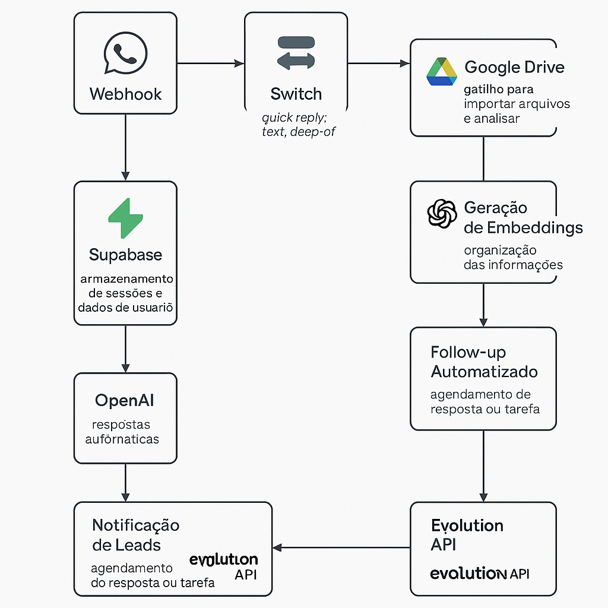

# Arquitetura do Workflow

O fluxo principal se divide nos seguintes módulos:

- **Entrada de mensagens:** via webhook Evolution API
- **Classificação:** texto, áudio ou imagem
- **Sessões e contexto:** identificação e rastreio de conversas por sessionID
- **IA RAG:** respostas com base em histórico e embeddings
- **Vetorização:** documentos enviados ao Google Drive são processados e vetorizados
- **Follow-up:** mensagens de retomada automáticas
- **Alertas:** envio de novos leads para grupos

